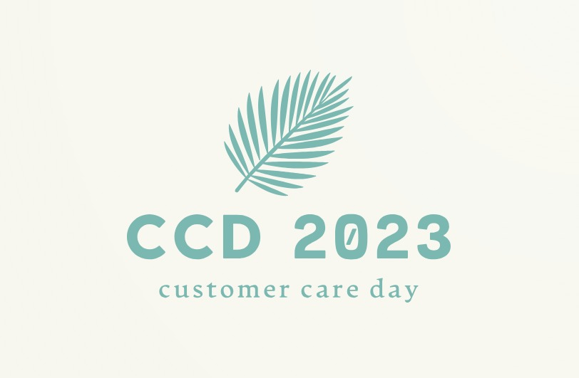
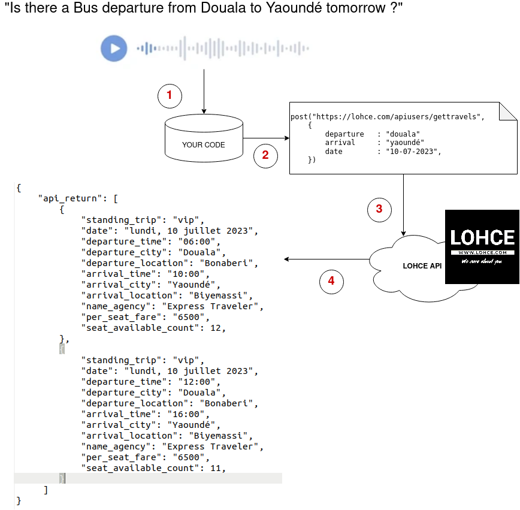

# Careathon 2023

Careathon 2023 is the first virtual Competition organize by [LOHCE](https://www.lohce.com) during the Customer Care Day 2023, which will be held the 15th July, 2023. 

At [LOHCE](https://www.lohce.com) our priority is to make it even easier for your fellow Cameroonians to buy bus tickets online in order to reduce stress when preparing for the trip.

It is on this occasion that we want to reward Care Developers, i.e. people who deeply care about helping the users of what the build.



Here is the List of cthe ontestants for this first edition.

| Team name | Leader | Team Members | Location |
| --------- | --------- | --------- | --------- |
| Expo | Leonel NGOYA | 1 | Yaoundé |
| Infinite Plus One | Djoufson CHE BENE | 2 | Douala |
| Bukela | Aser Dipanda | 1 | Douala |
| Resilience des vainqueurs |  Daniel Yvan WELLE PACK  | 3 | Douala |
| FodyDev |   Fomegne Brady  | 1 | Buea |

The winner of the Careathon will receive a cash prize of 25 000 FCFA and the prestigious title of the "Best Cameroonian Care developer".

## Competition details

Here is the competition timeline

| Timeline | detail |
| --------- | --------- |
| 09th, July 2023 | Competition start, contestant received all instructions |
| 12th, July 2023 | Competition end, contestants provide links to their code on opensource repository |
| 13th, July 2023 | judges start evaluating contestant works |
| 15th, July 2023 | The winner is reveal during the Customer Care Day event |

### delivery details 

- The competition is virtual, thus You can code from anywhere You want.
- You can use whateven language to write Your code, just make sure to properly document how the judges will proceed to test it properly
- Your code will be publish as an opensource project on a git repository on github
- You must provide a proper documentation on how to install and test Your code
- Your code will be test on the voice file below as input

| Query | Voice file |
| --------- | --------- |
| "Is there a bus departure from Douala to Yaounde tomorrow ?" | [download](https://drive.google.com/file/d/11sjEjiqSx16k2WUJyA3HRprOuVY7UCMN/view?usp=sharing)  |
| "Y a-t-il un départ de bus de Douala à Yaoundé demain ?" | [download](https://drive.google.com/file/d/1Mc8bYDyi-rtIgOOS8ROGj-UuSek1PDht/view?usp=sharing) |


### the winner details 

The winner will be the contestant with the highest score on 3 evaluation categories: `functionality`, `robustness` and `code accessibility`.
Your code will be rate over 100 on each of the above category 

| Judge | Evaluation category | details |
| --------- | --------- | --------- |
| LOHCE | Fonctionnality | Is Your code properly display the result from LOHCE API on the two input file |
| OSS Cameroun | Code accessibility | How easy is it to install and test Your code |
| Users | Robustness | Is Your code working on the same query input but from Yaoundé to Douala and with a different voice (Yours and a random people one) |


### The competition topic

The topic of the competition is to develop a query extration from a voice file and generate an API REQUEST to www.lohce.com API.



#### Step 1

Your code get the voice file as an input, here are links to two files that You will use as input to test and develope Your code.

#### Step 2

Your code use a voice recognition technique (anyone) to extract the query and formulate a query to be send to LOHCE API

```bash
    var departure   = "douala";
    var arrival     = "yaounde"; 
    var date        = "10-07-2023";
```

#### Step 3

Your code build an POST Request to LOHCE API at `https://lohce.com/apiusers/gettravels` to get the result of the query formulate in the query.

Here is a Javascript example of an API LOHCE request using jquery.


```javascript
<script src="https://ajax.googleapis.com/ajax/libs/jquery/3.3.1/jquery.min.js"> </script>   
<script src="https://cdnjs.cloudflare.com/ajax/libs/blueimp-md5/2.5.0/js/md5.min.js"> </script>

<script type="text/javascript">

    var api_key     = "rh8b2v4tLJ2avDBZ";
    var departure   = "douala";
    var arrival     = "yaounde"; 
    var date        = "10-07-2023";
    var language    = "fr";
    var version     = "1.0";
    var hash        =  md5(api_key+departure+arrival+date+language+version);
    
    $.post("https://lohce.com/apiusers/gettravels",
    {
        api_key     : api_key,
        departure   : departure,
        arrival     : arrival, 
        date        : date,
        language    : language,
        version     : version,
        hash        : hash,
    }) 
    .done(function ( data ) {
        var obj = JSON.parse(data);
        console.log(obj);
    })
    .fail(function ( xhr, textStatus) {
        reject(textStatus);
    });
</script>    
```

> **_NOTE:_**  The note content.

| variables | detail |
| -------- | -------- |
| `api_key` | the API Key which authenticate You query call. It is *mandatory*. Its value must be `rh8b2v4tLJ2avDBZ` in Your code |
| `departure` | the departure city. Its value can be `yaounde` or `douala` depending on what You found in the voice input |
| `arrival` | the arrival city. Its value can be `yaounde` or `douala` depending on what You found in the voice input |
| `date` | the date of the travels requestion. Its value must be in the `dd-mm-YYYY` format in Your code |
| `language` | the language of the query. Its value must either `fr` or `en` |
| `version` | the version of the LOHCE API requested. Its value must either `1.0` |
| `hash` | this is a `md5` hash of all Your parameters. Its value must be `md5(api_key+departure+arrival+date+language+version)` in Your code |

### Step 4 Getting result from LOHCE API

Here is an example of LOHCE API response to the query.

```json
{
    "api_callback_status": "SUCCESS",
    "api_type": "sandbox",
    "api_return": [
        {
            "token_trip": "d0de932b79f1fc7c6492223e0f623253",
            "standing_trip": "vip",
            "webui_link": "https://www.lohce.com/search/71d6abed26e6ef3d8a7922cc30165aa35f922220/fr?from_city_default=&from_city_select=20&to_city_select=19&departure_date_select=10%2F07%2F2023&btnSubmit=RECHERCHER#bus_result_505182",
            "date": "lundi, 10 juillet 2023",
            "end_of_online_sales": "lundi, 10 juillet 2023 05:00",
            "departure_time": "06:00",
            "departure_time_dmy": "10-07-2023",
            "departure_city": "Douala",
            "departure_location": "Bonaberi",
            "trip_view_count": 2,
            "arrival_time": "10:00",
            "arrival_city": "Yaoundé",
            "arrival_location": "Biyemassi",
            "name_agency": "Express Traveler",
            "logo_agency": "https://www.lohce.com/img/logo_agency/expresstraveler_logo_2.png",
            "per_seat_nettopay": 6900,
            "per_seat_fare": "6500",
            "per_seat_commission": "400",
            "per_seat_shared_commission": 0,
            "currency": "XAF",
            "bus_image": "https://www.lohce.com/img/buses/1668503153_1605758500_bus_mentravel.jpg",
            "seat_available_count": 12,
            "seat_selection_available": 0,
            "services_trip": [
                {
                    "key": "cold_service_bus",
                    "availability": 1,
                    "name": "Air conditionné",
                    "icon": "fa-thermometer-empty"
                },
                {
                    "key": "wifi_service",
                    "availability": 1,
                    "name": "Wifi",
                    "icon": "fa-wifi"
                },
                {
                    "key": "food_service",
                    "availability": 1,
                    "name": "Restauration à board",
                    "icon": ""
                },
                {
                    "key": "toilet_service",
                    "availability": 1,
                    "name": "Toillette",
                    "icon": ""
                },
                {
                    "key": "luggage_service",
                    "availability": 1,
                    "name": "Service baggage",
                    "icon": ""
                },
                {
                    "key": "tv_service",
                    "availability": 1,
                    "name": "Television",
                    "icon": "fa-television"
                },
                {
                    "key": "power_service",
                    "availability": 1,
                    "name": "prise électrique à board",
                    "icon": "fa-plug"
                }
            ],
            "age_range_discount": [
                {
                    "title": "Bébé",
                    "key": "baby",
                    "range": "0-4",
                    "amount": 0
                },
                {
                    "title": "Enfant",
                    "key": "child",
                    "range": "4-6",
                    "amount": 3250
                },
                {
                    "title": "Adulte",
                    "range": "6-more",
                    "key": "adult",
                    "amount": 6500
                }
            ],
            "ebookng_value": {
                "introduction": "La commission que vous payez par billet en ligne vous donne droit aux services suivants:",
                "values": [
                    "Un service client disponible 24/7 par appel, whatsapp, email, Réseaux Sociaux (ce que nous sommes en train de faire actuellement)",
                    "La possibilité de modifier votre billet en ligne au moins deux heures avant",
                    "La possibilité d'annuler votre billet en ligne et vous faire rembourser par MTN ou Orange Money",
                    "La continuité du service lorsque vous arrivez au guichet après votre achat, en d'autres termes l'agence vous attendra"
                ]
            }
        },
        {
            "token_trip": "01d7a1f471026b2704a91d71d972eaf2",
            "standing_trip": "vip",
            "webui_link": "https://www.lohce.com/search/71d6abed26e6ef3d8a7922cc30165aa35f922220/fr?from_city_default=&from_city_select=20&to_city_select=19&departure_date_select=10%2F07%2F2023&btnSubmit=RECHERCHER#bus_result_505184",
            "date": "lundi, 10 juillet 2023",
            "end_of_online_sales": "lundi, 10 juillet 2023 11:00",
            "departure_time": "12:00",
            "departure_time_dmy": "10-07-2023",
            "departure_city": "Douala",
            "departure_location": "Bonaberi",
            "trip_view_count": 1,
            "arrival_time": "16:00",
            "arrival_city": "Yaoundé",
            "arrival_location": "Biyemassi",
            "name_agency": "Express Traveler",
            "logo_agency": "https://www.lohce.com/img/logo_agency/expresstraveler_logo_2.png",
            "per_seat_nettopay": 6900,
            "per_seat_fare": "6500",
            "per_seat_commission": "400",
            "per_seat_shared_commission": 0,
            "currency": "XAF",
            "bus_image": "https://www.lohce.com/img/buses/1668503153_1605758500_bus_mentravel.jpg",
            "seat_available_count": 12,
            "seat_selection_available": 0,
            "services_trip": [
                {
                    "key": "cold_service_bus",
                    "availability": 1,
                    "name": "Air conditionné",
                    "icon": "fa-thermometer-empty"
                },
                {
                    "key": "wifi_service",
                    "availability": 1,
                    "name": "Wifi",
                    "icon": "fa-wifi"
                },
                {
                    "key": "food_service",
                    "availability": 1,
                    "name": "Restauration à board",
                    "icon": ""
                },
                {
                    "key": "toilet_service",
                    "availability": 1,
                    "name": "Toillette",
                    "icon": ""
                },
                {
                    "key": "luggage_service",
                    "availability": 1,
                    "name": "Service baggage",
                    "icon": ""
                },
                {
                    "key": "tv_service",
                    "availability": 1,
                    "name": "Television",
                    "icon": "fa-television"
                },
                {
                    "key": "power_service",
                    "availability": 1,
                    "name": "prise électrique à board",
                    "icon": "fa-plug"
                }
            ],
            "age_range_discount": [
                {
                    "title": "Bébé",
                    "key": "baby",
                    "range": "0-4",
                    "amount": 0
                },
                {
                    "title": "Enfant",
                    "key": "child",
                    "range": "4-6",
                    "amount": 3250
                },
                {
                    "title": "Adulte",
                    "range": "6-more",
                    "key": "adult",
                    "amount": 6500
                }
            ],
            "ebookng_value": {
                "introduction": "La commission que vous payez par billet en ligne vous donne droit aux services suivants:",
                "values": [
                    "Un service client disponible 24/7 par appel, whatsapp, email, Réseaux Sociaux (ce que nous sommes en train de faire actuellement)",
                    "La possibilité de modifier votre billet en ligne au moins deux heures avant",
                    "La possibilité d'annuler votre billet en ligne et vous faire rembourser par MTN ou Orange Money",
                    "La continuité du service lorsque vous arrivez au guichet après votre achat, en d'autres termes l'agence vous attendra"
                ]
            }
        },
        {
            "token_trip": "278160c23524efb14b108a1cbf497dca",
            "standing_trip": "vip",
            "webui_link": "https://www.lohce.com/search/71d6abed26e6ef3d8a7922cc30165aa35f922220/fr?from_city_default=&from_city_select=20&to_city_select=19&departure_date_select=10%2F07%2F2023&btnSubmit=RECHERCHER#bus_result_505186",
            "date": "lundi, 10 juillet 2023",
            "end_of_online_sales": "lundi, 10 juillet 2023 17:00",
            "departure_time": "18:00",
            "departure_time_dmy": "10-07-2023",
            "departure_city": "Douala",
            "departure_location": "Bonaberi",
            "trip_view_count": 1,
            "arrival_time": "22:00",
            "arrival_city": "Yaoundé",
            "arrival_location": "Biyemassi",
            "name_agency": "Express Traveler",
            "logo_agency": "https://www.lohce.com/img/logo_agency/expresstraveler_logo_2.png",
            "per_seat_nettopay": 6900,
            "per_seat_fare": "6500",
            "per_seat_commission": "400",
            "per_seat_shared_commission": 0,
            "currency": "XAF",
            "bus_image": "https://www.lohce.com/img/buses/1668503153_1605758500_bus_mentravel.jpg",
            "seat_available_count": 12,
            "seat_selection_available": 0,
            "services_trip": [
                {
                    "key": "cold_service_bus",
                    "availability": 1,
                    "name": "Air conditionné",
                    "icon": "fa-thermometer-empty"
                },
                {
                    "key": "wifi_service",
                    "availability": 1,
                    "name": "Wifi",
                    "icon": "fa-wifi"
                },
                {
                    "key": "food_service",
                    "availability": 1,
                    "name": "Restauration à board",
                    "icon": ""
                },
                {
                    "key": "toilet_service",
                    "availability": 1,
                    "name": "Toillette",
                    "icon": ""
                },
                {
                    "key": "luggage_service",
                    "availability": 1,
                    "name": "Service baggage",
                    "icon": ""
                },
                {
                    "key": "tv_service",
                    "availability": 1,
                    "name": "Television",
                    "icon": "fa-television"
                },
                {
                    "key": "power_service",
                    "availability": 1,
                    "name": "prise électrique à board",
                    "icon": "fa-plug"
                }
            ],
            "age_range_discount": [
                {
                    "title": "Bébé",
                    "key": "baby",
                    "range": "0-4",
                    "amount": 0
                },
                {
                    "title": "Enfant",
                    "key": "child",
                    "range": "4-6",
                    "amount": 3250
                },
                {
                    "title": "Adulte",
                    "range": "6-more",
                    "key": "adult",
                    "amount": 6500
                }
            ],
            "ebookng_value": {
                "introduction": "La commission que vous payez par billet en ligne vous donne droit aux services suivants:",
                "values": [
                    "Un service client disponible 24/7 par appel, whatsapp, email, Réseaux Sociaux (ce que nous sommes en train de faire actuellement)",
                    "La possibilité de modifier votre billet en ligne au moins deux heures avant",
                    "La possibilité d'annuler votre billet en ligne et vous faire rembourser par MTN ou Orange Money",
                    "La continuité du service lorsque vous arrivez au guichet après votre achat, en d'autres termes l'agence vous attendra"
                ]
            }
        }
    ]
}
```